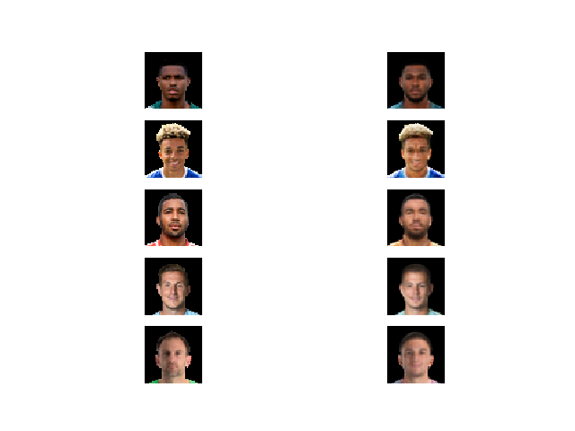
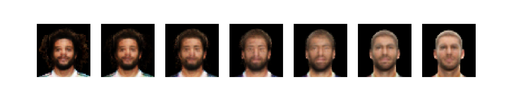
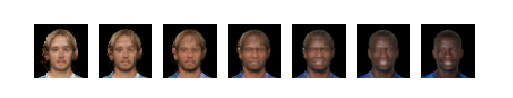

# FIFA VAE 

This repository contains an implementation of a Variational Autoencoder 
for creating fake FIFA football players. See in depth tutorial on Medium post
 titled [Generating fake FIFA football players with Variational Autoencoders and Tensorflow]().


## File list

- donwloader.py:  FIFA images script downloader
- main.py:  Script to train the network (see parameters below)
- network.py: Class with VAE network definition
- dataset.py: Data pipeline using tensorflow dataset API
- utils.py: Simple functions that are used in multiple files
- eval.py: Script to evaluate network after training (see parameters below)

## Downloader
The downloader script is downloader.py and it can receive two parameters:
```
--n_threads                  Number of threads to create 
--destination_folder         Directory were data will be downloaded to
```
### Run downloader
```bash
$ python downloader.py  20  Data/Images
```

## Training
Once the data has been downloaded, the training phase can start. The training file is _main.py_ and receives the following 
parameters:

```
-- learning_rate      Initial learning rate
--epochs              Number of training epochs 
--batch_size          Minibatch training size
--latent_dim          Number of latent space dimensions
--test_image_number   Number of test images to recover during training
--epochs_to_plot      Number of epochs before saving test sample of reconstructed images
--save_after_n        Number of epochs before saving network
--logdir              Log folder
--inputs_decoder      Size of decoder input layer
--data_path           Data folder path
--shuffle             Shuffle dataset (boolean)
```

#### Run Training

```bash
$ python main.py --latent_dim=2 --batch_size=512 --data_path=Data/Images --epochs=1000
```

### Examples
The examples can only being executed once the training it's complete or when we have some previously saved model.

```
--learning_rate             Learning rate used in trained (model names use this parameter)
--max_epoch                 Max epoch saved 
--latent_dim                Number of latent space dimensions for model
--create_fake_players       Number of fake players to generate
--recover_top_5             Reconstructs top 5 FIFA players from their latent vector
--meshgrid                  Creates meshgrid of points in latent space and shows reconstructed images [only when latent_dim = 2]
--mix_players               List with two image paths to mix
--n_interpolations          Number of interpolations between mixed players
--countries                 List of countries to compute average player
```

#### Run examples

```bash
$ python eval.py --latent_dim=15 --max_epoch=980
```

#### Some examples

Compare original images with the reconstructed ones.

---

When our model was trained with a  two dimensional latent space, we can get the following plot.

---

Compute the interpolation between two different players.



---

Generate average players for each of the given countries.


---


