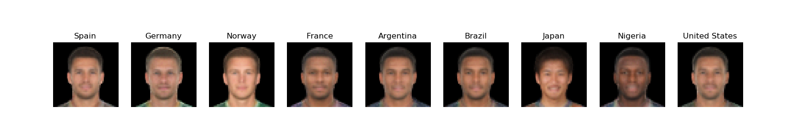

# FIFA VAE 

This repository contains an implementation of a Variational Autoencoder 
for creating fake FIFA football players. See in depth tutorial on Medium post
 titled [Generating fake FIFA football players with Variational Autoencoders and Tensorflow]().


### Parameters

```
-- learning_rate      Initial learning rate
--epochs              Number of training epochs 
--batch_size          Minibatch training size
--latent_dim          Number of latent space dimensions
--test_image_number   Number of test images to recover during training
--epochs_to_plot      Number of epochs before saving test sample of reconstructed images
--save_after_n        Number of epochs before saving network
--logdir              Log folder
--inputs_decoder      Size of decoder input layer
--data_path           Data folder path
--shuffle             Shuffle dataset (boolean)
```

### Run Training

```bash
$ python main.py --latent_dim=2 --batch_size=1024 --data_path=Data/Images --epochs=1000
```

### Examples
The examples can only being executed once the training it's complete or when we do have some saved model.
#### Eval

This script is used to compare original images with the reconstructed ones.


When our model was trained with a  two dimensional latent space, we can get the following plot.
```bash
$ python eval.py 
```


#### Mix Players

This is the script to compute the interpolation between two different players.
Input data must be tuned inside the file.
```bash
$ python mix_players.py 
```


#### Average Player

This script is used to generate average players for each of the given countries. Once again, parameters must be tuned 
inside the script.
```bash
$ python average_player.py 
```



